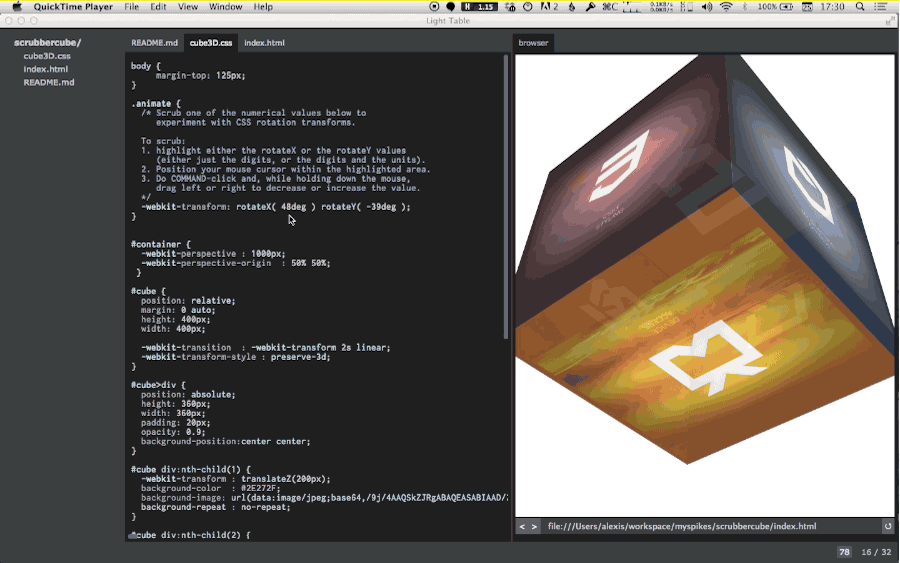

# Scrubber and the 3D Scrubber

This is a simple example of using the Light Table plugin [Scrubber](https://github.com/stratospark/lt-scrubber) to manipulate CSS transform values.

This style of scrubbing interface to manipulate code values, with real-time feedback of the result, has been popularized by Mr Bret Victor, and is available via his JS library [Tangle](http://worrydream.com/Tangle/).

## example

Here's a video of what this example looks like in Light Table:

</img>

## How to use

The Light Table docs are great. In summary, use CTRL-SPACE to open up a siderbar letting you type the names of commands to execute.

Commands to setup Light Table:
1. Command: Show Plugin Manager
2. In the plugin manager, select "available" plugins and install Scrubber.
3. Command: Add a tabset
4. Command: add browser tab
5. In the left tabset, open index.html and cube3D.css. In the right tabset, open the file index.html by putting into the navigation bar a URL like `file:///your/absolute/path/to/scrubbercube/index.html`.

How to scrub:
1. In the left tabset, open `index.html` and `cube3D.css`.
2. In the CSS property `-webkit-transform` for the `.animate` selector, highlight either the rotateX or the rotateY values (either just the digits, or the digits and the units).
3. Position your mouse cursor within the highlighted area.
4. Do COMMAND-click and, while holding down the mouse, drag left or right to decrease or increase the value.

You should see the cube rotate as you modify the values of the rotation transform. Enjoy!

# References

The code for the HTML5/CSS cube comes from this [CodePen sample](http://cssdeck.com/labs/simple-css3-3d-cube), which also shows how to use keyframe animation and works on non-Webkit browsers.
